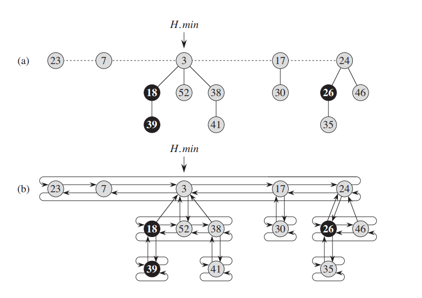

## 1. Supporting Operations
Fibonacci heap supports following operations(min-heap):

 - `new_heap()` constructor
 - `insert(x)` insert element `x` into heap
 - `union(H)` create one new heap combining `*this` and `H`
 - `min()` return a pointer to min
 - `extract()` delete min node, and return its pointer
 - `destroy(&Node)` delete element x from heap, note: x needs to be a pointer 
 - `search(x)` search element one by one, if use the `destory(x)` needs to find the element first
 - `degrade_key(&Node, k)` degrade key value, first argument needs to be pointer

 Fibonacci heap has very desirable amortized cost: except `extract()`, `destroy(&Node)` have `O(lgn)` complexity, `search()` has `O(n)` complexity, others all maintain an `O(1)` complexity.

## 2. Implementation
Fibonacci heap has a collection of min-heap ordered trees. 
