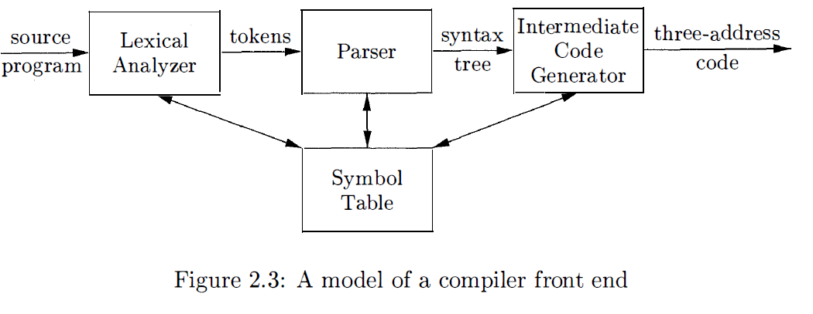
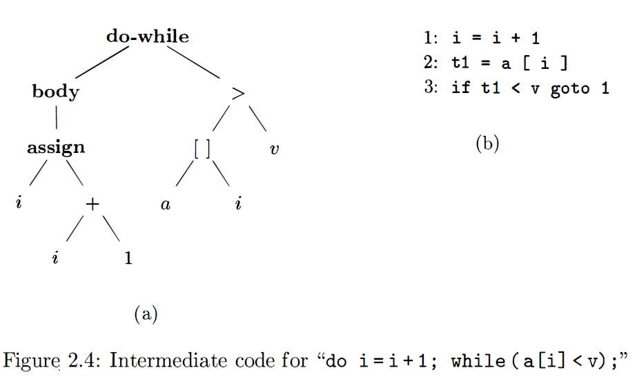
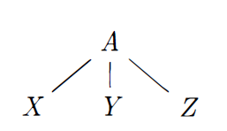
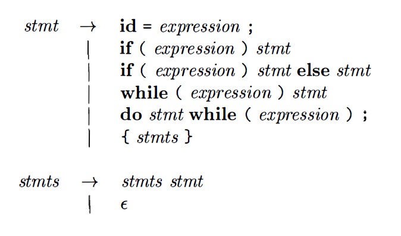
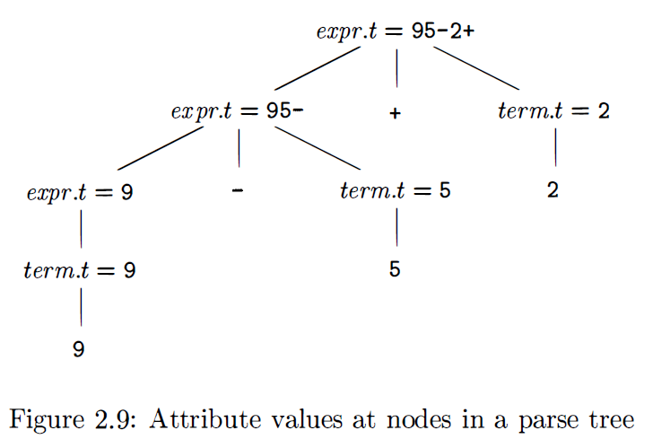
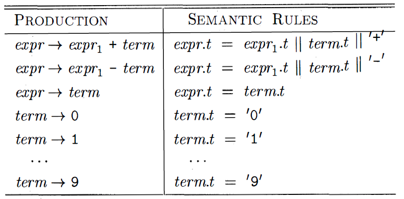
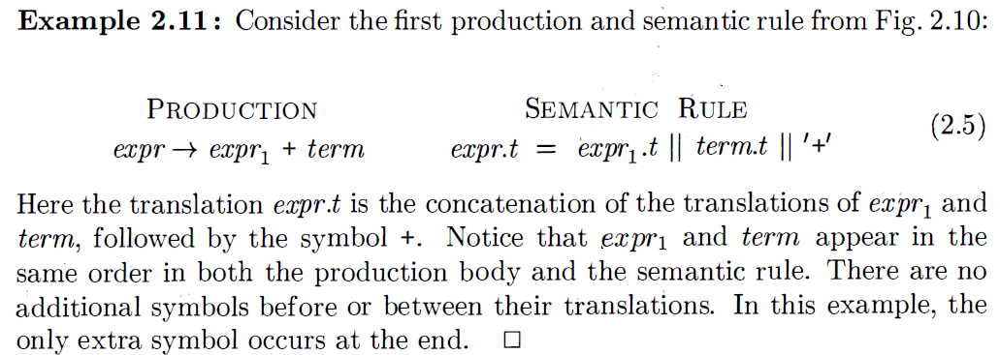
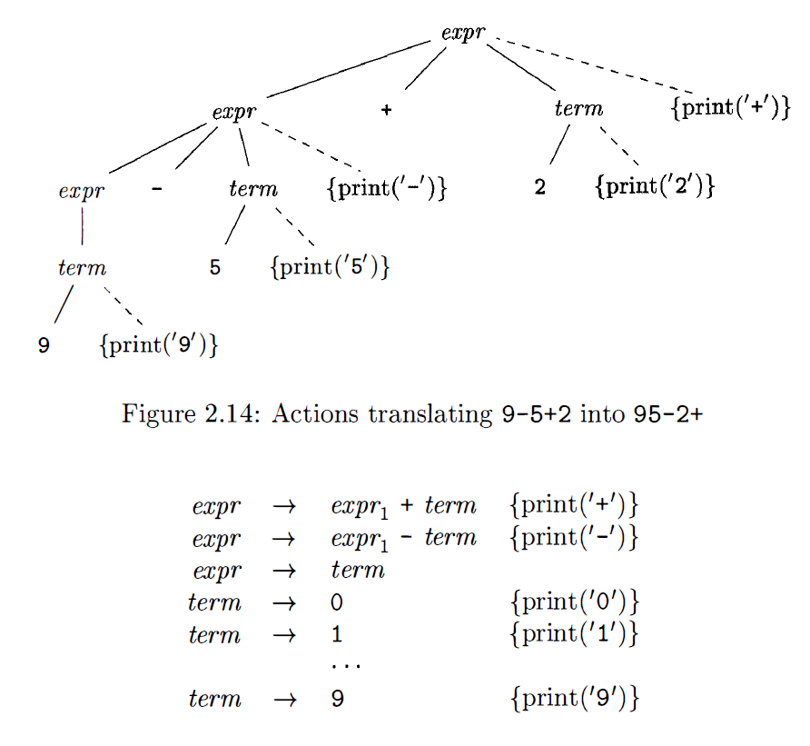
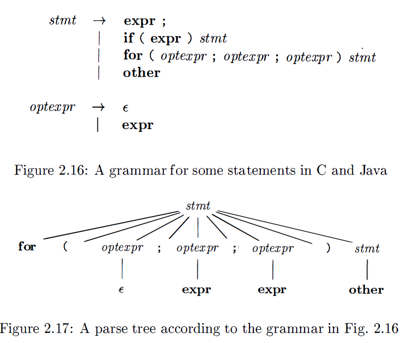
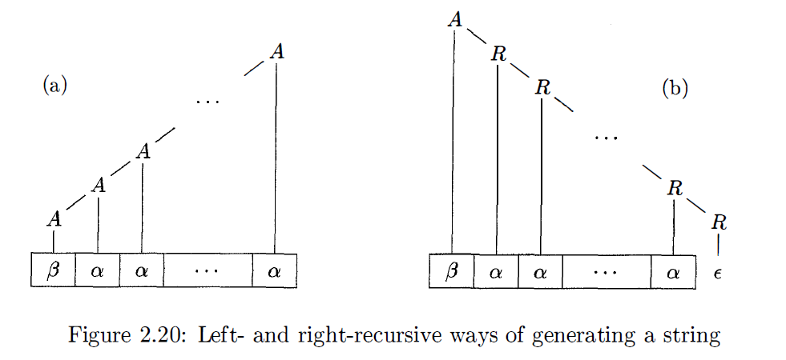

## Syntax-Directed Translator
**syntax**: the proper form of its program -> context-free grammar or BNF(Backus-Naur Form)
**semantic**: meaning of the program

goal: syntax-directed translation of infix expressions to postfix form. 


These are two intermediate representation forms. 

### Syntax Definition
```
stmt -> if (expr) stmt else stmt
```
This is one **production**. In a production, lexical elements like the keyword **if** and the parentheses are called **terminals**. Variables like **expr** and **stmt** represent sequences of terminals and are called **nonterminals**. 
**context-free grammar elements**
>  1. A set of terminal symbols(refered as tokens)
>  2. A set of nonterminals, sometimes called **syntactic variables**
>  3. A set of productions, where each production consists of a nonterminal, called the head or left side of the production, an arrow, and a sequence of terminals and/or nonterminals , called the body or right side of the production
>  4. A designation of one of the nonterminals as the **start** symbol. 

#### Derivations
A grammar derives strings by beginning with the start symbol and repeatedly replacing a **nonterminal** by the body of a production for that nonterminal.
example for function call:
```
call -> id(optparams)
optparams -> params | epsilon
params -> params, param | param
```
`epsilon` represents empty string of symbols. 
### Parse Trees
Parsing is the problem of taking a string of terminals and figuring out how to derive it from the start symbol of the grammar.
 
From left to right , the leaves of a parse tree form the **yield** of the tree, which is the string **derived** from the nonterminal at the root of the parse tree. 
### Ambiguity
A grammar can have more than one parse tree generating a given string of terminals. Such a grammar is said to be **ambiguous**.
#### Operator Assocaitivity
Like `9 + 5 + 2`, this expression can be evaluated as `( 9 + 5 ) + 2` or `9 + (5 + 2)`. We
say that the operator + associates to the left, because an operand with plus signs on both sides of it belongs to the operator to its left.
**left-associative**: addition, subtraction, multiplication, division
**right-associative**: equal, exponentiation 
strings like `a = b = c` can be generated by rules like 
```
right -> letter = right | letter
letter -> a | b | ... | z
```
#### Operator Precedence
`*` has higher priority than `+`
```
term -> term * factor
		 | term / factor
		 | factor
expr -> expr + term
		| expr - term
		| term
factor -> digit | (expr)
```
factors are expression which cannot be "torn apart“ by any operator. 
Terms is an expression that can be "torn apart" by operators of the higher precedence, but not by the lower precedence operators. 

### Syntax-Directed Translation
Syntax-directed translation is done by attaching rules or program fragments to productions in a grammar.
**Attributes** An attribute is any quantity associated with a programming construct. 
Examples of attributes are data types of expressions, the number of instructions in the generated code, or the location of the first instruction in the generated code for a construct , among many other possibilities.
**translation schemes** A translation scheme is a notation for attaching program fragments to the productions of a grammar. The program fragments are executed when the production is used during syntax analysis.
#### Synthesized Attributes
The idea of associating quantities with programming constructs -- for example, values and types with expressions --  can be expressed in terms of grammars. 
A **syntax-directed definition** associates:
1. With each grammar symbol, a set of attributes, and 
2. With each production, a set of **semantic rules** for computing the values of the attributes associated with the symbols appearing in the production.



The string representing the translation of the nonterminal at the head of each production is the concatenation of the translations of the nonterminals in the production body, in the same order as in the production, with some optional additional strings interleaved.

**Tree traversals** will be used for describing attribute evaluation and for specifying the execution of code fragments in a translation scheme.
```
DFS
procedure visit(N) {
	for (each child of N, from left to right) {
		visit(child);
	}
	evaluate rule at N;
}
```
If the action is done when we first visit a node, then we may refer to the traversal as a preorder traversal. Similarly, if the action is done just before we leave a node for the last time, then we say it is a postorder traversal of the tree.
A **syntax-directed translation**  scheme is a notation for specifying a translation by attaching program fragments to productions in a grammar.
**the order of evaluation of the semantic rules is explicitly specified**
Program fragments embedded within production bodies are called **semantic actions**. The position at which an action is to be executed is shown by enclosing it between curly braces and writing it within the production body
```
rest -> + term {print('+') } rest1
```


### Parsing
Parsing is the process of determining how a string of terminals can be generated by a grammar. 
Parsing techniques : "top-down", "bottom-up"
#### Top-Down Parsing

1. At node N, labeled with nonterminal A, select one of the productions for A and construct children at N for the symbols in the production body.
2. Find the next node at which a subtree is to be constructed, typically the leftmost unexpanded nonterminal of the tree.
This method requires trail and error, and backtracking. May not be a good candidate
#### Predictive Parsing
**recursive-descent parsing** is a top-down approach. Here we consider one simple version--predictive parsing: 
> The sequence of procedure calls during the analysis of an input string implicitly defines a parse tree for the input
```
void stmt () {
	switch ( lookahead ) {
	case expr:
		match (expr) ; match (' ; ') ; break;
	case if:
		match (if) ; match (' C'); match (expr) ; match (' ) ') ; stmt O ;
		break;
	case for:
		match (for) ; match (' C');
		optexpr O ; match (' ; ') ; optexprO ; match (' ; ') ; optexprO ;
		match (' ) ') ; stmt O ; break;
	case other;
		match (other) ; break;
	default:
		report ( " syntax error " );
}
void optexpr() {
	if ( lookahead = = expr ) match (expr) ;
}
void match (terminal t) {
	if ( lookahead = = t ) lookahead = nextTerminal;
	else report ( " syntax error " );
}
```
Predictive parsing relies on information about the first symbols that can be generated by a production body. Our predictive parser uses an E-production as a default when no other production
can be used.

let $\alpha$ be a string of grammar symbols (terminals and/or nonterminals). We define First($\alpha$) to be the set of terminals that appear as the first symbols of one or more strings of terminal generated from $\alpha$.
```
FIRST ( stmt) = { expr, if, for, other}
FIRST( expr ; ) = {expr}
```
A predictive parser is a program consisting of a procedure for every nonterminal. The procedure fot nonterminal A does two things:
1. It decides which A-production to use by examining the lookahead symbol. The production with body $\alpha$is used if the lookahead symbol is in FIRST ($\alpha$) .
2. The procedure then mimics the body of the chosen production.

#### Left-recursion
```
expr -> expr + term
```
It's possible for a recursive-descent parser to loop forever if the leftmost symbol is the same as head. Since the lookahead symbol changes only when a terminal in the body is matched, no change to the input took place between recursive calls of `expr`. 
> A -> A$\alpha$ | $\beta$
> can be replaced by 
> A -> $\beta$R
> R -> $\alpha$R | $\epsilon$

The first one is left-recursive, the second is right-recursive. But right recursive makes it hard to translate left-associate operators. 

