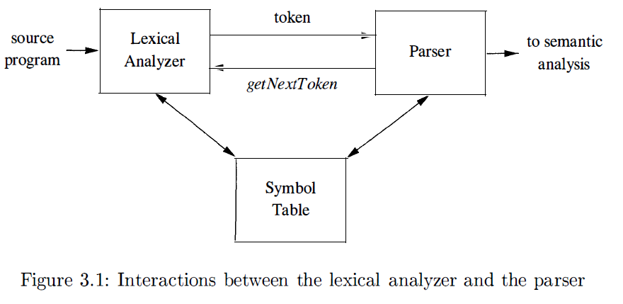
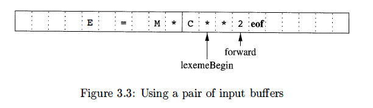
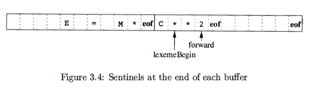
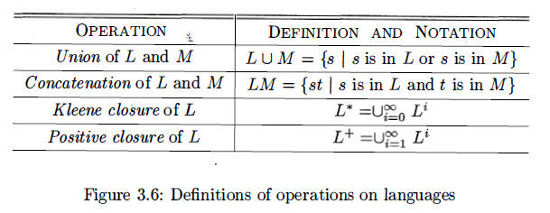
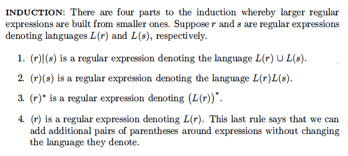
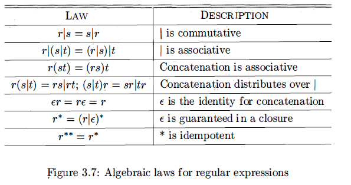

## Chapter 3 Lexical Analysis
**goal**: identify each lexeme and return information on token
### 3.1 Lexical Analyzer Role
(1) read input characters, group them into lexemes, and produce output a sequence of tokens
(2) When the lexical analyzer discovers a lexeme constituting an identifier, it needs to enter that lexeme into the symbol table. 

The figure suggests, parser will call lexical analyzer, and lexical analyzer read characters until find next token. 
lexical analyzer will also do some additional jobs:
(1) strip whitespace
(2) record line number for error message
#### 3.1.1 Basic Concepts
(1) A **token** is a pair consisting of a token name and an optional attribute value. The token name is an abstract symbol representing a kind of lexical unit. 
(2) A **pattern** is a description of the form that the lexemes of a token may take. 
the sequence of character which can form keywords
(3) A **lexeme** is a sequence of characters in the source program that matches the pattern for a token and is identified by the lexical analyzer as an instance of the token. 
In most programming languages, the following classes cover most or all of the tokens:
(1) One token for each keyword. The pattern for a keyword is the same as the keyword itself.
(2) Tokens for the operators
(3) One token representing all identifiers.
(4) One or more tokens representing constants
(5) To kens for each punctuation symbol, such as left and right parentheses, comma, and semicolon.
Sometimes, token can have different matches, for example, 0 and 1 both match for **number**. So we not only need token names, we also need token attributes. The token name influences parsing decisions, while the attribute value influences translation of tokens after the parse. 
The appropriate attribute value for an identifier is a pointer to the symbol table entry for that identifier. 
**Lexical Errors** suppose a situation arises in which the lexical analyzer is unable to proceed because none of the patterns for tokens matches any prefix of the remaining input. The simplest recovery strategy is "panic mode" recovery. We delete successive characters from the remaining input, until the lexical analyzer can find a well-formed token at the beginning of what input is left. This recovery technique may confuse the parser, but in an interactive computing environment it may be quite adequate.

### 3.2 Input Buffer
There are many situations where we need to look at least one additional character ahead. 

We can use a buffer pair to resolve the problem. Each buffer is of the same size N, which is usually the size of a disk block. Using one system read command we can read N characters into a buffer, rather than using one system call per character. 
In the buffer, two pointers are maintained. 
(1) Pointer lexemeBegin, marks the beginning of the current lexeme, whose extent we are attempting to determine.
(2) Pointer forward scans ahead until a pattern match is found; the exact strategy whereby this determination is made will be covered in the balance of this chapter.

We can add **sentinels** at the end of each buffer. 
```
switch (*forward++) {
	case eof: 
		if (forward is at end of first buffer) {
			reload second buffer;
			forward = beginning of second buffer;
		}
		else if (forward is at the end of second buffer) {
			reload first buffer;
			forward = beginning of first buffer;
		}
		else 
			terminate lexical analysis
		break;
	case for other characters;
}
```
### 3.3 Token Specification
An **alphabet** is any finite set of symbols. 
A **string** over an alphabet is a finite sequence o symbols drawn from the alphabet. 
A **language** is any countable set of strings over some fixed alphabet. 
**operations on language**

#### 3.3.1 Regular Expression
We are able to describe identifiers by giving names to sets of letters and digits and using the language operators union, concatenation, and closure. This process is so useful that a notation called **regular expression** has come into common use for describing all the language that can be built from these operators applied to the symbols of some alphabet.  
Here are the rules that define the regular expressions over some alphabet $\Sigma$ and the languages that those expressions denote. 
There are two rules that form the basis:
(1) $\epsilon$ is a regular expression, and $L(\epsilon)$ is $\{\epsilon\}$, that is, the language whose sole member is empty string. 
(2) If $a$ is a symbol in $\Sigma$, then $a$ is a regular expression, and $L(a) = \{a\}$, that is, the language with one string, of length one, with $a$ in its one position. 


#### 3.3.2 Extensions of Regular Expressions
(1) One or more instances. `(r)+`
(2) Zero or one instance. `r?`
(3) Character classes `[abc]`

### 3.4 Recognition of Tokens
